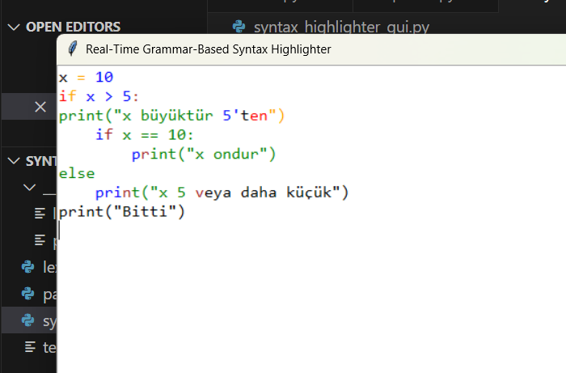
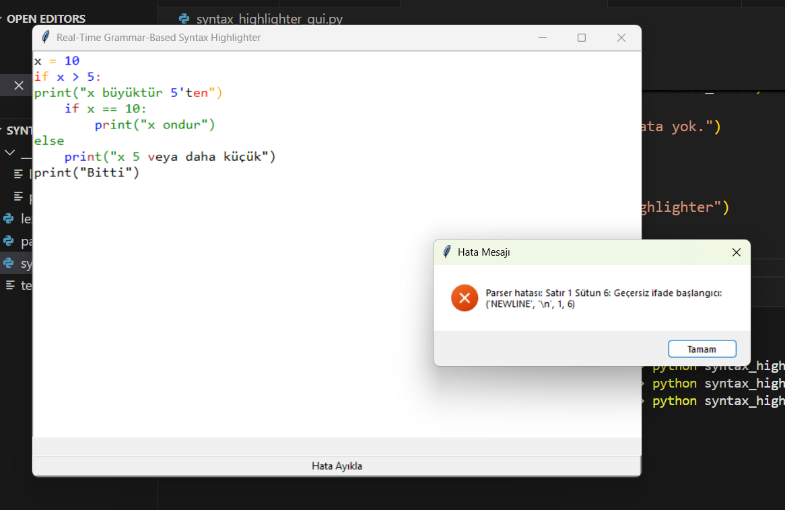

# 🖍️ Real-Time Grammar-Based Syntax Highlighter

## 📌 Proje Hakkında

Bu proje, Python benzeri **girinti tabanlı** bir programlama dili için **gerçek zamanlı sözdizimi vurgulayıcı (syntax highlighter)** geliştirmeyi amaçlamaktadır. 

Kullanıcı kod yazarken:
- Lexing (sözcüksel analiz) ve 
- Parsing (yapısal analiz) işlemleri **anında** gerçekleşir.

Hatalar anlık olarak tespit edilir ve kullanıcıya görsel olarak bildirilir. Böylece, hem hızlı hem de hatasız bir kodlama deneyimi sağlanır.

---

## 🚀 Özellikler

- ✅ **Gerçek zamanlı lexing ve parsing:** Yazılan her karakter sonrası analiz yapılır.
- 🧩 **Girinti tabanlı dil desteği:** Python benzeri yapılar algılanır.
- 🎨 **Renkli sözdizimi vurgulama:**
  - Anahtar kelimeler
  - Sayılar
  - String ifadeler
  - Yorum satırları
  - Operatörler
  farklı renklerle gösterilir.
- ⚠️ **Anlamlı hata mesajları:** Hatalar satır ve açıklama ile kullanıcıya bildirilir.
- 🖥️ **Kullanıcı dostu GUI:** Tkinter tabanlı hafif ve işlevsel arayüz.

---

## 🎬 Proje Videosu

Projeyi canlı olarak izlemek ve nasıl çalıştığını görmek için videoyu izleyin:

👉 [Proje Tanıtım ve Kullanım Videosu](https://youtu.be/VIDEO_LINKINIZ)

---

## ⚙️ Kurulum

1. Bu repoyu klonlayın:

```bash
git clone https://github.com/rumeysaersoyy/syntax_highlighter.git
cd syntax_highlighter
```

---

## ▶️ Kullanım

Projeyi başlatmak için terminal veya komut istemcisinde şu komutu girin:

```bash
python syntax_highlighter_gui.py
```

Program çalıştığında bir GUI penceresi açılacaktır. Bu pencereye aşağıdaki gibi örnek bir kod yazabilirsiniz:

```python
x = 10
if x > 5:
    print("x büyüktür 5'ten")
    if x == 10:
        print("x ondur")
else:
    print("x 5 veya daha küçük")
print("Bitti")
```

---

## 🖼️ Proje Görselleri

### 📌 Kod Yazma Ekranı


### ❗ Hata Gösterimi


---

## 👩‍💻 Geliştirici

**Rumeysa Ersoy**  
BLM0238 - Programlama Dilleri Projesi  
2025 Bahar Dönemi

---

## 📄 Lisans

Bu proje açık kaynaklıdır ve [MIT Lisansı](LICENSE) ile lisanslanmıştır.
